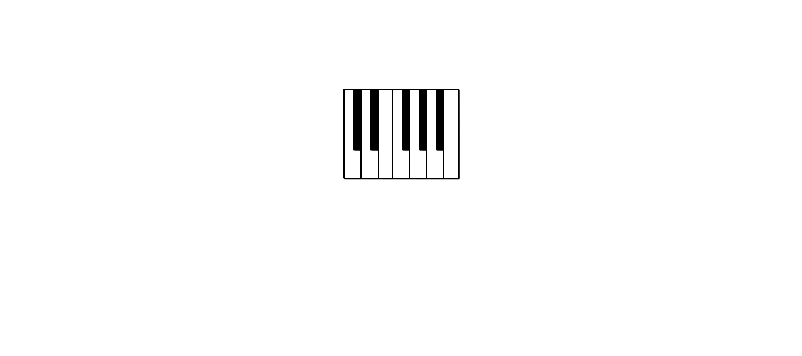

# Piano

<p align="center">
  
</p>

<p align="center">
  <a href="https://forthebadge.com">  </a>
  <a href="https://forthebadge.com">  </a>
  <a href="https://forthebadge.com">  </a>
</p>

## :scroll: Sobre

> Piano simples feito para tocar as notas:

<pre>
* Dó  - C
* Ré  - D
* Mi  - E
* Fá  - F
* Sol - G
* Lá  - A
* Si  - B
</pre>

---

## :rocket: Tecnologias utilizadas

- HTML
- CSS
- JavaScript

---

## :computer: Como baixar o projeto

```bash
  // Clonar o repositório
  $ git clone https://github.com/jjoaovitor7/Piano

  // Entrar no diretório
  $ cd Piano

```

---
